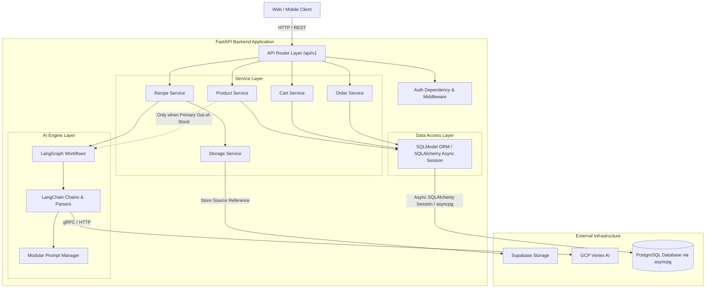

# Document 02: Architecture & System Layout

## 1. High-Level System Architecture
The application is structured as a **Modular Monolith** built on Python and FastAPI. It cleanly separates HTTP routing, business logic, AI orchestration, and data persistence layers.



---

## 2. Layering & Technical Responsibilities

### A. API Router Layer (`app/api/v1/`)
- Exposes RESTful HTTP endpoints using OpenAPI definitions.
- Validates inbound request payloads using Pydantic schemas.
- Enforces authentication using FastAPI dependencies (`get_current_user`).
- Returns standardized HTTP status codes and JSON error structures.
- **Rule**: Contains zero direct SQL queries and zero LLM invocation logic.

### B. Service Layer (`app/services/`)
- Contains all core business logic (cart management, inventory checking, checkout transactions, order generation).
- Orchestrates interactions between data models, storage services, and AI workflows.
- Manages PostgreSQL database transactions via Async SQLAlchemy Sessions.

#### Image & Camera Processing Flow
Image uploads and camera captures follow the exact same unified backend ingestion pipeline. Supabase Storage stores the source file reference and is strictly decoupled from the AI/business logic layer:

```
Image Upload / Camera Capture
        ↓
FastAPI (/recipes/process-image)
        ↓
Recipe Service
        ↓
Storage Service
        ↓
Supabase Storage (Stores Source File Reference)
        ↓
AI Processing Layer
        ↓
LangChain
        ↓
Vertex AI
        ↓
Structured Recipe / Ingredients
```

#### Deterministic Product Discovery vs. Alternative AI Ranking
Normal product discovery is strictly deterministic and does NOT depend on LangGraph or LLMs:

```
Canonical Ingredient
        ↓
Product Service
        ↓
SQLModel / Async SQLAlchemy Session
        ↓
PostgreSQL (asyncpg)
        ↓
Matching Product Variants (All In-Stock Brands & Package Sizes)
        ↓
Inventory Check
```

AI orchestration (`LangGraph` / `LangChain`) is invoked by `ProductService` **ONLY** after the out-of-stock gatekeeper determines:
1. No matching primary product variant is available in inventory across all brands and package sizes.
2. Product catalog metadata (`metadata_json`) identifies compatible alternatives.
3. Deterministic inventory filtering leaves eligible, available alternatives.

```
Eligible Available Alternatives (From DB Metadata & Inventory Filter)
        ↓
Alternative Ranking Workflow (LangGraph)
        ↓
LangChain
        ↓
Vertex AI
        ↓
Ranked Alternatives (Presented to User)
```

### C. AI Engine Layer (`app/ai/`)
- **LangChain**: Handles prompt template hydration, Vertex AI LLM invocation, and structured Pydantic output parsing (`with_structured_output`).
- **LangGraph**: Orchestrates stateful multi-step AI tasks (`recipe_graph` for extraction & canonical normalization; `alternative_graph` for ranking in-stock metadata alternatives).
- **Prompt Management (`app/prompts/`)**: Externalized text templates for system and human prompts.
- **Rule**: AI services never perform direct SQL mutations or update inventory.

### D. Data Access Layer & Database Connection Architecture (`app/models/` & `app/core/database.py`)
The database access stack is configured as follows:

```
FastAPI
   ↓
Async SQLAlchemy Session
   ↓
SQLModel Models (Combines Pydantic & SQLAlchemy ORM)
   ↓
asyncpg (Async PostgreSQL Driver)
   ↓
PostgreSQL Database
```

- **SQLModel** remains the sole ORM and data model layer.
- No secondary ORM or fallback database provider is introduced.

---

## 3. Directory Structure
The repository follows a clean modular directory layout, with external source integrations grouped under `app/integrations/`:

```
backend/
├── app/
│   ├── __init__.py
│   ├── main.py                     # FastAPI application initialization & middleware
│   │
│   ├── api/                        # HTTP Router Endpoints
│   │   └── v1/
│   │       ├── __init__.py
│   │       ├── router.py           # Master v1 API Router
│   │       ├── auth.py             # Signup, Login, Me endpoints
│   │       ├── recipes.py          # Processing & Recipe endpoints
│   │       ├── products.py         # Catalog & Dynamic Matching endpoints
│   │       ├── cart.py             # Cart & Cart Item endpoints
│   │       ├── orders.py           # Checkout & Order endpoints
│   │       └── inventory.py        # Inventory lookup endpoints
│   │
│   ├── core/                       # App Configuration & System Plumbing
│   │   ├── config.py               # Pydantic BaseSettings (env vars)
│   │   ├── database.py             # Async SQLAlchemy engine & session maker
│   │   ├── security.py             # JWT generation, validation, & password hashing
│   │   └── dependencies.py         # FastAPI Depends (Auth, DB Session)
│   │
│   ├── models/                     # SQLModel Database Models
│   │   ├── user.py                 # User Entity
│   │   ├── recipe.py               # Recipe Entity
│   │   ├── recipe_ingredient.py    # Recipe Ingredient Entity
│   │   ├── product.py              # Product Entity
│   │   ├── product_variant.py      # Product Variant / SKU Entity
│   │   ├── inventory.py            # Inventory Entity
│   │   ├── cart.py                 # Cart Entity
│   │   ├── cart_item.py            # Cart Item Entity
│   │   ├── order.py                # Order Entity
│   │   └── order_item.py           # Order Item Entity
│   │
│   ├── schemas/                    # Pydantic Schemas for DTOs & Request/Response
│   │   ├── auth.py
│   │   ├── recipe.py
│   │   ├── product.py
│   │   ├── cart.py
│   │   └── order.py
│   │
│   ├── services/                   # Business Logic Services
│   │   ├── recipe_service.py
│   │   ├── product_service.py
│   │   ├── inventory_service.py
│   │   ├── cart_service.py
│   │   ├── order_service.py
│   │   └── storage_service.py      # Supabase Storage integration
│   │
│   ├── ai/                         # LangChain & LangGraph AI Layer
│   │   ├── llm.py                  # Vertex AI LLM client instantiation
│   │   ├── chains/                 # LangChain LCEL chains
│   │   │   ├── recipe_extraction.py
│   │   │   └── alternative_ranking.py
│   │   ├── workflows/              # LangGraph Graphs
│   │   │   ├── recipe_graph.py
│   │   │   └── alternative_graph.py
│   │   └── schemas/                # LLM Structured Output Pydantic Models
│   │       ├── recipe_output.py
│   │       └── alternative_output.py
│   │
│   ├── prompts/                    # External Prompt Templates
│   │   ├── recipe_extraction/
│   │   │   ├── system.txt
│   │   │   └── human.txt
│   │   └── alternative_ranking/
│   │       ├── system.txt
│   │       └── human.txt
│   │
│   └── integrations/               # External Source Integrations
│       ├── webpage_fetcher.py      # Web page HTML fetcher & text extractor
│       └── youtube_transcript.py   # YouTube transcript extractor
│
├── tests/                          # Test Suite
│   ├── unit/
│   ├── integration/
│   └── ai/
│
├── alembic/                        # Database Migration Scripts
├── docs/                           # Technical Documentation Package
├── .env.example
├── Dockerfile
├── requirements.txt
└── README.md
```

---

## 4. Key Architectural Constraints & Rationale

1. **No Microservices**: A modular monolith reduces operational overhead, eliminates distributed transaction complexities (Sagas), and guarantees ACID compliance during checkout using PostgreSQL row locking.
2. **Single Database Target**: PostgreSQL with `JSONB` support eliminates the need for a separate document database or graph store for metadata relationships.
3. **Single Storage Provider Specification**: Supabase Storage is the single configured storage provider for the MVP. Credentials and connection configuration are supplied through environment variables. No fallback storage provider is implemented.
4. **Environment-Driven Configuration**: All sensitive keys (Vertex credentials, Supabase API keys, JWT secrets) are loaded strictly via `pydantic-settings` from system environment variables.
