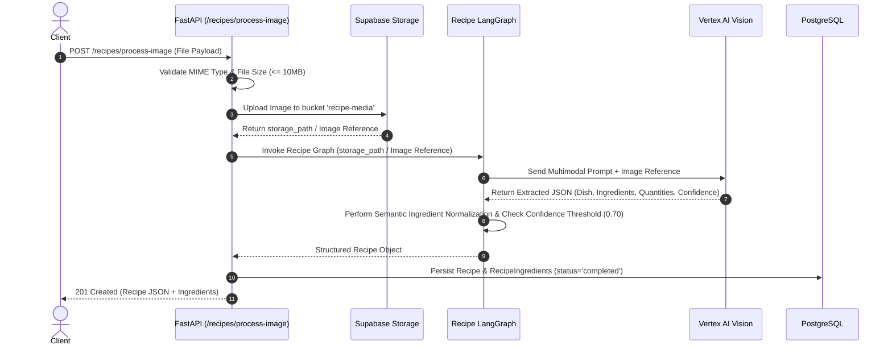
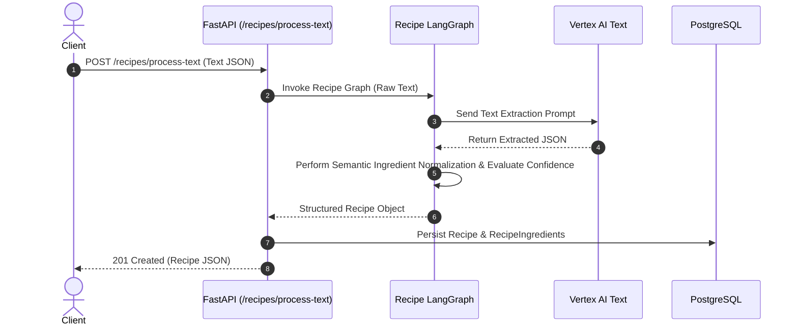
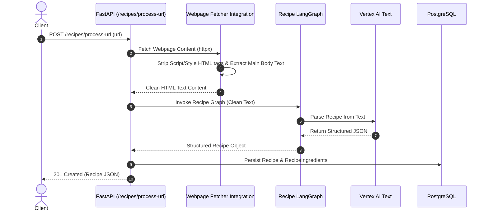
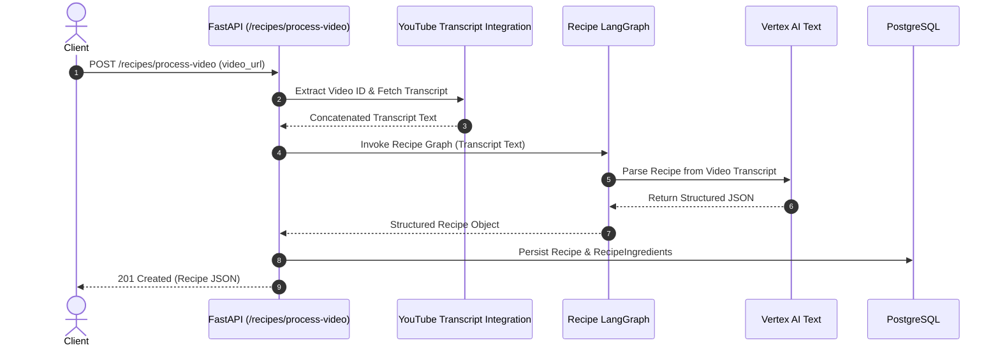
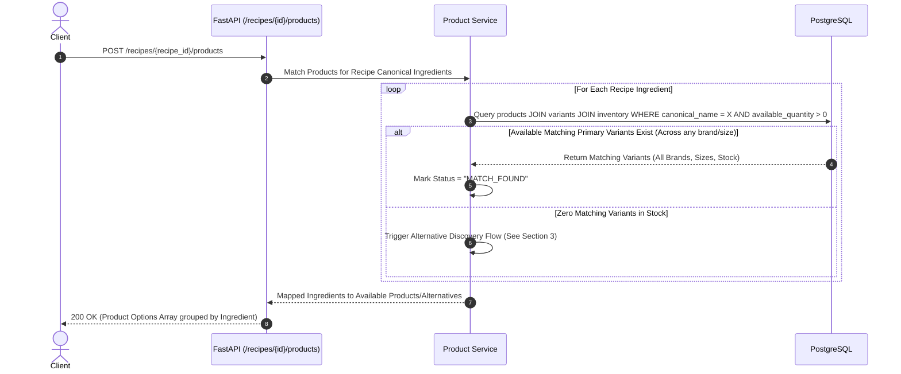
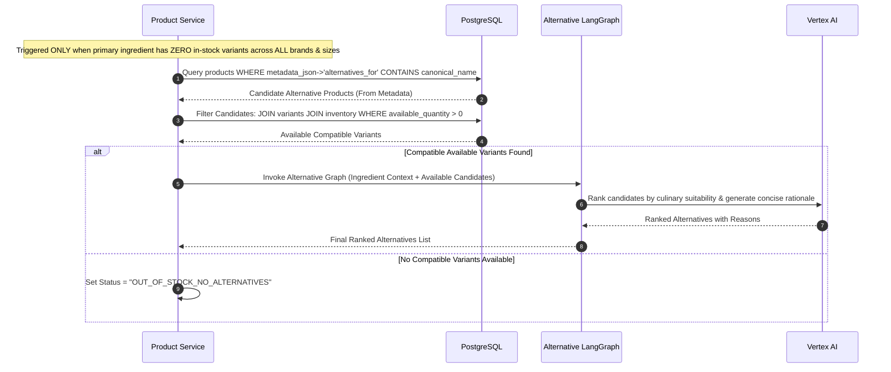
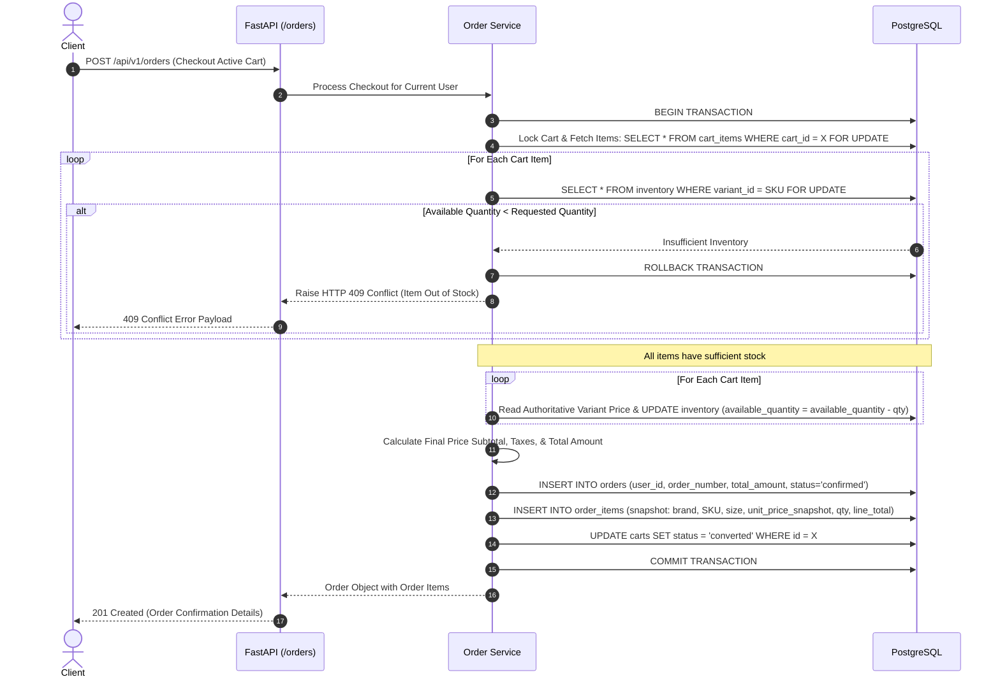

# Document 03: Complete System & Data Flows

## 1. Recipe Processing Ingestion Flows

### A. Image & Camera Upload Flow
Camera capture and normal image upload use the **exact same backend image processing pipeline**. Public image URLs are NOT required by the architecture; storage path or supported image reference mechanisms are passed to the AI pipeline.



---

### B. Plain Text Recipe Flow


---

### C. Recipe Webpage URL Flow


---

### D. YouTube Video URL Flow


---

### E. Semantic Ingredient Normalization Principle
The AI engine is responsible strictly for **semantic ingredient normalization**:

```
"fresh whole milk" ──┐
"toned milk" ───────┼───► LLM ───► canonical_name: "milk"
"cow milk" ─────────┘
```

The LLM produces the standardized canonical identifier string (e.g. `milk`). After normalization:
- Backend services use the canonical identifier to query PostgreSQL for actual products and product variants.
- The LLM **MUST NOT**: query the database directly, select an actual SKU, control inventory, or invent catalog products.

---

## 2. Product Discovery & Matching Flow

### Recipe Quantity vs. Purchase Quantity Rule
Recipe ingredient quantity (e.g., `Milk = 500ml`) is informational and does **NOT** constrain the user's purchase selection.
- **Example**: A user may select `Milk 1L × 1`, `Milk 1L × 2`, or `Milk 2L × 1` for a `500ml` recipe requirement.
- **Inventory Constraint**: The system strictly enforces `requested_purchase_quantity <= available_inventory_quantity`. It does **NOT** enforce `purchase_quantity == recipe_quantity`.



---

## 3. Alternative Compatibility & Recommendation Flow

Alternative recommendations are triggered **ONLY** when no purchasable product variant matching the canonical ingredient is available in inventory across all relevant brands and package sizes.

```
Primary Ingredient
        ↓
Check ALL matching product variants
        ↓
Any primary variant available?
        │
    ┌───┴────┐
    │        │
   YES       NO
    │        │
    ▼        ▼
Show       Product Metadata
Primary        ↓
Products   Eligible Alternatives
               ↓
           Inventory Filter
               ↓
           Available Alternatives
               ↓
           LLM Ranking
               ↓
           Show Alternatives
```

> [!IMPORTANT]
> **LLM Input Boundaries**: The LLM receives **ONLY** alternatives that:
> 1. Are already declared compatible by product catalog metadata (`metadata_json->'alternatives_for'`).
> 2. Exist in the catalog.
> 3. Have available inventory (`available_quantity > 0`).
>
> The LLM may rank or explain eligible alternatives. The LLM **must NOT** determine alternative compatibility itself or recommend out-of-stock items.



---

## 4. Cart & Checkout Pipeline Flow

### Authoritative Pricing & Order Snapshot Rule
During checkout, the Order Service reads the **authoritative current product variant price** from PostgreSQL when calculating the order total and writes an immutable snapshot into `order_items`.

- **Example**:
  - `ProductVariant`: Current price = ₹120
  - `OrderItem Snapshot`: `unit_price_snapshot = ₹120`, `quantity = 2`, `line_total = ₹240`
- Preserves financial audit trails even if product prices change in the future.

### Atomic Checkout Transaction Flow
```
BEGIN TRANSACTION
        ↓
Lock relevant inventory rows (SELECT ... FOR UPDATE)
        ↓
Validate requested quantities (available_quantity >= requested_quantity)
        ↓
Read authoritative current prices
        ↓
Calculate subtotal / taxes / total
        ↓
Deduct inventory
        ↓
Create order
        ↓
Create order item snapshots
        ↓
Convert cart
        ↓
COMMIT
```


