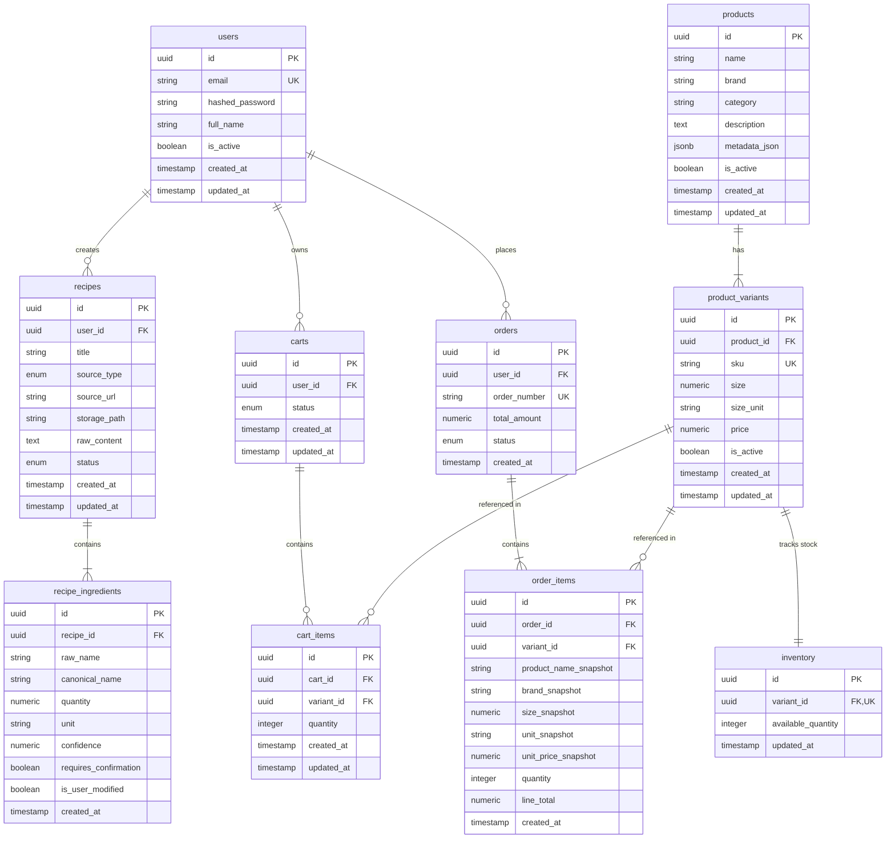

# Document 04: Database Schema & Entity Design

## 1. Entity Relationship Diagram (ERD)



---

## 2. Product Metadata JSONB Contract & Discovery Principles

### A. Product Metadata JSONB Contract
The `products.metadata_json` column uses PostgreSQL `JSONB` to store structured product classification and authoritative compatibility data.

#### Primary Product Metadata Contract
```json
{
  "canonical_ingredients": ["milk"],
  "product_type": "dairy",
  "sub_type": "cow_milk",
  "alternatives_for": []
}
```

#### Compatible Alternative Product Metadata Examples
```json
{
  "canonical_ingredients": ["almond_milk"],
  "product_type": "plant_based",
  "sub_type": "almond_milk",
  "alternatives_for": ["milk"]
}
```

```json
{
  "canonical_ingredients": ["soy_milk"],
  "product_type": "plant_based",
  "sub_type": "soy_milk",
  "alternatives_for": ["milk"]
}
```

#### Field Contract Definitions
- **`canonical_ingredients`** *(Array of Strings)*: List of canonical ingredient identifiers satisfied by this product. Used by `ProductService` for deterministic primary product matching.
- **`product_type`** *(String)*: Broad product classification (e.g., `dairy`, `plant_based`, `pantry`). Used for catalog organization and display context.
- **`sub_type`** *(String)*: Specific product variant classification (e.g., `cow_milk`, `almond_milk`, `soy_milk`, `oat_milk`).
- **`alternatives_for`** *(Array of Strings)*: Authoritative list of canonical ingredient identifiers for which this product is a compatible alternative.

> [!IMPORTANT]
> **Metadata Authoritativeness**: Alternative compatibility is defined strictly by database metadata. The LLM **does NOT** create or infer these relationships. Catalog metadata determines compatibility first; the LLM only ranks and explains pre-filtered eligible alternatives.

---

### B. `canonical_name` as Primary Product Matching Key
`recipe_ingredients.canonical_name` is the primary semantic key generated by the AI engine during ingredient normalization.

```
Raw Ingredient: "fresh whole milk"
        ↓ (LLM Normalization)
canonical_name = "milk"
        ↓
ProductService (Deterministic Query)
        ↓
PostgreSQL Query: products.metadata_json->'canonical_ingredients' CONTAINS ["milk"]
```

- The LLM **does NOT** select an actual SKU, query PostgreSQL, or decide inventory availability.
- The backend performs all catalog lookups and stock filtering deterministically.

---

### C. Category vs. Canonical Ingredient Responsibilities
No separate category tables or relational category microservices exist for the MVP.
- **`canonical_ingredients`**: Used for deterministic recipe ──► product catalog matching.
- **`category` / `product_type` / `sub_type`**: Used for catalog classification, navigation, and display context.
- **`alternatives_for`**: Used for deterministic alternative compatibility lookup.

---

### D. Out-of-Stock Gatekeeper & Alternative Discovery Rule
Alternative products are queried **ONLY IF** there are **ZERO in-stock primary product variants** matching the canonical ingredient across all relevant brands and package sizes.

```
Recipe Requirement: canonical_name = "milk"
        ↓
Query Primary SKUs: Amul 500ml (0), Amul 1L (0), Nandini 500ml (0)
        ↓
Zero In-Stock Primary Variants Found
        ↓
Query Metadata Alternatives: metadata_json->'alternatives_for' CONTAINS ["milk"]
        ↓
Filter DB: JOIN product_variants JOIN inventory WHERE available_quantity > 0
        ↓
Send In-Stock Candidates to LLM for Ranking & Rationale Generation
```

- **LLM Boundaries**: The LLM MAY rank eligible alternatives, explain suitability, and order candidates. The LLM MUST NOT invent products, invent compatibility relationships, override metadata, recommend unavailable items, modify inventory, select SKUs, or make purchasing decisions.
- **Primary In-Stock Protection**: If even **ONE** primary matching variant is in stock, show primary products and **DO NOT** trigger the alternative flow.

---

### E. Package Size & Purchase Quantity Rules
- **Recipe Size Freedom**: Recipe required size (e.g., `Milk = 500ml`) does **NOT** restrict the available product variants shown. All active in-stock variants (`500ml`, `1L`, `2L`) across all brands are presented. The user chooses the package size. `recipe_size == product_variant_size` is **NOT** enforced as a matching constraint.
- **Purchase Quantity Independence**: Recipe quantity is purely informational. Users may purchase any quantity (`1 × 500ml`, `2 × 500ml`, `1 × 1L`, `2 × 1L`). The system strictly enforces `requested_purchase_quantity <= available_inventory_quantity`. `purchase_quantity == recipe_quantity` is **NOT** enforced.

---

## 3. SQLModel Entity Definitions & Validation Constraints

> [!IMPORTANT]
> **Monetary Fields Standard**: All monetary values (`price`, `total_amount`, `unit_price_snapshot`, `line_total`) MUST be defined as `decimal.Decimal` in Python / SQLModel and mapped to PostgreSQL `NUMERIC(10, 2)`. Floating-point types are strictly forbidden for currency.

### A. `users` Table
```python
# app/models/user.py
import uuid
from datetime import datetime
from typing import Optional, List
from sqlmodel import SQLModel, Field, Relationship

class User(SQLModel, table=True):
    __tablename__ = "users"

    id: uuid.UUID = Field(default_factory=uuid.uuid4, primary_key=True)
    email: str = Field(unique=True, index=True, nullable=False, max_length=255)
    hashed_password: str = Field(nullable=False, max_length=255)
    full_name: str = Field(nullable=False, max_length=255)
    is_active: bool = Field(default=True, nullable=False)
    created_at: datetime = Field(default_factory=datetime.utcnow, nullable=False)
    updated_at: datetime = Field(default_factory=datetime.utcnow, nullable=False)

    recipes: List["Recipe"] = Relationship(back_populates="user")
    carts: List["Cart"] = Relationship(back_populates="user")
    orders: List["Order"] = Relationship(back_populates="user")
```

---

### B. `recipes` Table
```python
# app/models/recipe.py
import uuid
from datetime import datetime
from enum import Enum
from typing import Optional, List
from sqlmodel import SQLModel, Field, Relationship, Column, VARCHAR

class SourceType(str, Enum):
    IMAGE = "image"
    CAMERA = "camera"
    TEXT = "text"
    RECIPE_URL = "recipe_url"
    VIDEO_URL = "video_url"

class RecipeStatus(str, Enum):
    PROCESSING = "processing"
    COMPLETED = "completed"
    FAILED = "failed"

class Recipe(SQLModel, table=True):
    __tablename__ = "recipes"

    id: uuid.UUID = Field(default_factory=uuid.uuid4, primary_key=True)
    user_id: uuid.UUID = Field(foreign_key="users.id", index=True, nullable=False)
    title: str = Field(nullable=False, max_length=255)
    source_type: SourceType = Field(sa_column=Column(VARCHAR(20), nullable=False))
    source_url: Optional[str] = Field(default=None, max_length=1024)
    storage_path: Optional[str] = Field(default=None, max_length=512)
    raw_content: Optional[str] = Field(default=None)
    status: RecipeStatus = Field(default=RecipeStatus.PROCESSING, sa_column=Column(VARCHAR(20), nullable=False))
    created_at: datetime = Field(default_factory=datetime.utcnow, nullable=False)
    updated_at: datetime = Field(default_factory=datetime.utcnow, nullable=False)

    user: Optional["User"] = Relationship(back_populates="recipes")
    ingredients: List["RecipeIngredient"] = Relationship(back_populates="recipe", sa_relationship_kwargs={"cascade": "all, delete-orphan"})
```

---

### C. `recipe_ingredients` Table
```python
# app/models/recipe_ingredient.py
import uuid
from datetime import datetime
from typing import Optional
from sqlmodel import SQLModel, Field, Relationship

class RecipeIngredient(SQLModel, table=True):
    __tablename__ = "recipe_ingredients"

    id: uuid.UUID = Field(default_factory=uuid.uuid4, primary_key=True)
    recipe_id: uuid.UUID = Field(foreign_key="recipes.id", index=True, nullable=False)
    raw_name: str = Field(nullable=False, max_length=255)
    canonical_name: str = Field(index=True, nullable=False, max_length=255)
    quantity: Optional[float] = Field(default=None)
    unit: Optional[str] = Field(default=None, max_length=50)
    confidence: float = Field(nullable=False, ge=0.0, le=1.0) # Validation constraint: 0.0 <= confidence <= 1.0
    requires_confirmation: bool = Field(default=False, nullable=False)
    is_user_modified: bool = Field(default=False, nullable=False)
    created_at: datetime = Field(default_factory=datetime.utcnow, nullable=False)

    recipe: Optional["Recipe"] = Relationship(back_populates="ingredients")
```

---

### D. `products` Table
```python
# app/models/product.py
import uuid
from datetime import datetime
from typing import Optional, List, Dict, Any
from sqlmodel import SQLModel, Field, Relationship, Column
from sqlalchemy.dialects.postgresql import JSONB

class Product(SQLModel, table=True):
    __tablename__ = "products"

    id: uuid.UUID = Field(default_factory=uuid.uuid4, primary_key=True)
    name: str = Field(nullable=False, max_length=255)
    brand: str = Field(index=True, nullable=False, max_length=255)
    category: str = Field(index=True, nullable=False, max_length=255)
    description: Optional[str] = Field(default=None)
    metadata_json: Dict[str, Any] = Field(default_factory=dict, sa_column=Column(JSONB, nullable=False))
    is_active: bool = Field(default=True, nullable=False)
    created_at: datetime = Field(default_factory=datetime.utcnow, nullable=False)
    updated_at: datetime = Field(default_factory=datetime.utcnow, nullable=False)

    variants: List["ProductVariant"] = Relationship(back_populates="product", sa_relationship_kwargs={"cascade": "all, delete-orphan"})
```

---

### E. `product_variants` Table (SKUs)
Represents purchasable SKUs tied to a master product entity.

```
Product: Amul Milk
   ├── Variant: SKU-AMILK-500 (size: 500ml, price: ₹28.00) ──► Inventory (available: 15)
   └── Variant: SKU-AMILK-1L   (size: 1L,    price: ₹54.00) ──► Inventory (available: 10)
```

```python
# app/models/product_variant.py
import uuid
from datetime import datetime
from decimal import Decimal
from typing import Optional
from sqlmodel import SQLModel, Field, Relationship, Column
from sqlalchemy import NUMERIC

class ProductVariant(SQLModel, table=True):
    __tablename__ = "product_variants"

    id: uuid.UUID = Field(default_factory=uuid.uuid4, primary_key=True)
    product_id: uuid.UUID = Field(foreign_key="products.id", index=True, nullable=False)
    sku: str = Field(unique=True, index=True, nullable=False, max_length=100)
    size: float = Field(nullable=False, gt=0.0) # Validation constraint: size > 0
    size_unit: str = Field(nullable=False, max_length=50)
    price: Decimal = Field(sa_column=Column(NUMERIC(10, 2), nullable=False), ge=Decimal("0.00")) # Decimal type & price >= 0
    is_active: bool = Field(default=True, nullable=False)
    created_at: datetime = Field(default_factory=datetime.utcnow, nullable=False)
    updated_at: datetime = Field(default_factory=datetime.utcnow, nullable=False)

    product: Optional["Product"] = Relationship(back_populates="variants")
    inventory: Optional["Inventory"] = Relationship(back_populates="variant")
```

---

### F. `inventory` Table
Stock quantities linked to specific variants. For MVP, checkout uses atomic row locking (`SELECT ... FOR UPDATE`); `reserved_quantity` is excluded.

```python
# app/models/inventory.py
import uuid
from datetime import datetime
from typing import Optional
from sqlmodel import SQLModel, Field, Relationship

class Inventory(SQLModel, table=True):
    __tablename__ = "inventory"

    id: uuid.UUID = Field(default_factory=uuid.uuid4, primary_key=True)
    variant_id: uuid.UUID = Field(foreign_key="product_variants.id", unique=True, index=True, nullable=False)
    available_quantity: int = Field(default=0, nullable=False, ge=0) # Validation constraint: available_quantity >= 0
    updated_at: datetime = Field(default_factory=datetime.utcnow, nullable=False)

    variant: Optional["ProductVariant"] = Relationship(back_populates="inventory")
```

---

### G. `carts` & `cart_items` Tables
Shopping cart and line items. The `UNIQUE(cart_id, variant_id)` constraint ensures that adding an existing SKU to the cart increments `quantity` on the existing row instead of creating duplicates.

```python
# app/models/cart.py
import uuid
from datetime import datetime
from enum import Enum
from typing import Optional, List
from sqlmodel import SQLModel, Field, Relationship, Column, VARCHAR
from sqlalchemy import UniqueConstraint

class CartStatus(str, Enum):
    ACTIVE = "active"
    CONVERTED = "converted"
    ABANDONED = "abandoned"

class Cart(SQLModel, table=True):
    __tablename__ = "carts"

    id: uuid.UUID = Field(default_factory=uuid.uuid4, primary_key=True)
    user_id: uuid.UUID = Field(foreign_key="users.id", index=True, nullable=False)
    status: CartStatus = Field(default=CartStatus.ACTIVE, sa_column=Column(VARCHAR(20), nullable=False))
    created_at: datetime = Field(default_factory=datetime.utcnow, nullable=False)
    updated_at: datetime = Field(default_factory=datetime.utcnow, nullable=False)

    user: Optional["User"] = Relationship(back_populates="carts")
    items: List["CartItem"] = Relationship(back_populates="cart", sa_relationship_kwargs={"cascade": "all, delete-orphan"})


class CartItem(SQLModel, table=True):
    __tablename__ = "cart_items"
    __table_args__ = (UniqueConstraint("cart_id", "variant_id", name="uq_cart_items_cart_variant"),)

    id: uuid.UUID = Field(default_factory=uuid.uuid4, primary_key=True)
    cart_id: uuid.UUID = Field(foreign_key="carts.id", index=True, nullable=False)
    variant_id: uuid.UUID = Field(foreign_key="product_variants.id", index=True, nullable=False)
    quantity: int = Field(default=1, nullable=False, gt=0) # Validation constraint: quantity > 0
    created_at: datetime = Field(default_factory=datetime.utcnow, nullable=False)
    updated_at: datetime = Field(default_factory=datetime.utcnow, nullable=False)

    cart: Optional["Cart"] = Relationship(back_populates="items")
    variant: Optional["ProductVariant"] = Relationship()
```

---

### H. `orders` & `order_items` Tables
Historical order records and immutable item snapshots.

```python
# app/models/order.py
import uuid
from datetime import datetime
from decimal import Decimal
from enum import Enum
from typing import Optional, List
from sqlmodel import SQLModel, Field, Relationship, Column, VARCHAR
from sqlalchemy import NUMERIC

class OrderStatus(str, Enum):
    PENDING = "pending"
    CONFIRMED = "confirmed"
    CANCELLED = "cancelled"

class Order(SQLModel, table=True):
    __tablename__ = "orders"

    id: uuid.UUID = Field(default_factory=uuid.uuid4, primary_key=True)
    user_id: uuid.UUID = Field(foreign_key="users.id", index=True, nullable=False)
    order_number: str = Field(unique=True, index=True, nullable=False, max_length=50)
    total_amount: Decimal = Field(sa_column=Column(NUMERIC(10, 2), nullable=False), ge=Decimal("0.00")) # Decimal type & total_amount >= 0
    status: OrderStatus = Field(default=OrderStatus.CONFIRMED, sa_column=Column(VARCHAR(20), nullable=False))
    created_at: datetime = Field(default_factory=datetime.utcnow, nullable=False)

    user: Optional["User"] = Relationship(back_populates="orders")
    items: List["OrderItem"] = Relationship(back_populates="order", sa_relationship_kwargs={"cascade": "all, delete-orphan"})


class OrderItem(SQLModel, table=True):
    __tablename__ = "order_items"

    id: uuid.UUID = Field(default_factory=uuid.uuid4, primary_key=True)
    order_id: uuid.UUID = Field(foreign_key="orders.id", index=True, nullable=False)
    variant_id: uuid.UUID = Field(foreign_key="product_variants.id", nullable=False)
    product_name_snapshot: str = Field(nullable=False, max_length=255)
    brand_snapshot: str = Field(nullable=False, max_length=255)
    size_snapshot: float = Field(nullable=False, gt=0.0)
    unit_snapshot: str = Field(nullable=False, max_length=50)
    unit_price_snapshot: Decimal = Field(sa_column=Column(NUMERIC(10, 2), nullable=False), ge=Decimal("0.00")) # Decimal type & price >= 0
    quantity: int = Field(nullable=False, gt=0) # Validation constraint: quantity > 0
    line_total: Decimal = Field(sa_column=Column(NUMERIC(10, 2), nullable=False), ge=Decimal("0.00")) # Decimal type & line_total >= 0
    created_at: datetime = Field(default_factory=datetime.utcnow, nullable=False)

    order: Optional["Order"] = Relationship(back_populates="items")
```

---

## 4. Database Indexing Strategy

```sql
-- GIN Index for dynamic JSONB metadata queries (canonical_ingredients & alternatives_for lookups)
CREATE INDEX idx_products_metadata_json_gin ON products USING gin (metadata_json);

-- Foreign Key & Canonical Lookup Indexes
CREATE INDEX idx_recipe_ingredients_canonical ON recipe_ingredients (canonical_name);
CREATE INDEX idx_products_brand ON products (brand);
CREATE INDEX idx_products_category ON products (category);
CREATE INDEX idx_product_variants_product_id ON product_variants (product_id);
CREATE UNIQUE INDEX idx_product_variants_sku ON product_variants (sku);
CREATE UNIQUE INDEX idx_inventory_variant_id ON inventory (variant_id);
CREATE INDEX idx_cart_items_cart_id ON cart_items (cart_id);
CREATE INDEX idx_cart_items_variant_id ON cart_items (variant_id);
CREATE UNIQUE INDEX idx_cart_items_cart_variant ON cart_items (cart_id, variant_id);
```

---

## 5. Architectural Constraints Checklist & Non-Goals

To maintain simple modular monolith integrity, the database design explicitly **EXCLUDES**:
- Product recommendation services or separate recommendation databases.
- Separate category services or category tables.
- Standalone brand tables.
- SQL Agent / Natural language SQL engines.
- Vector databases or Graph databases.
- Separate inventory microservices.
- Payment gateway tables or transaction logs.
- Multi-tenancy / `tenant_id` columns.
