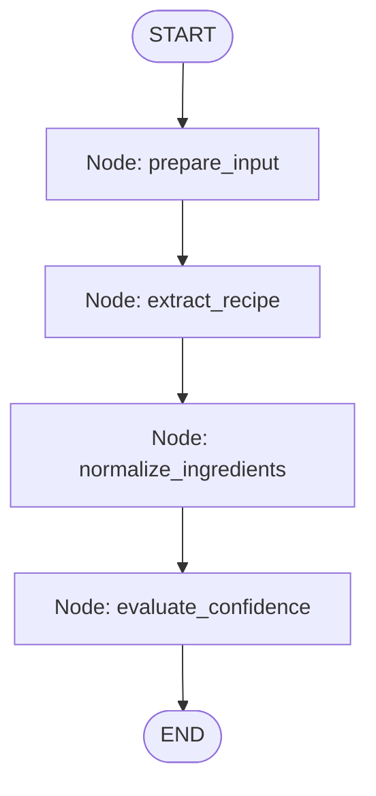
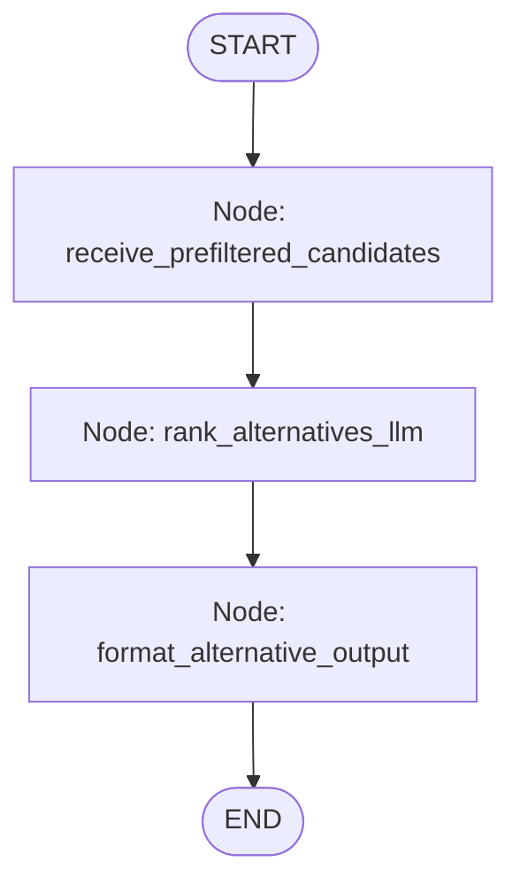

# Document 06: AI & Workflow Architecture

## 1. Vertex AI & LangChain Foundation
The system utilizes GCP Vertex AI through the `langchain-google-vertexai` package.

### Configuration Parameters
- **Configurable Primary Model**: `VERTEX_MODEL_NAME` (Default: `gemini-1.5-flash` or `gemini-1.5-flash-001`). Configured via environment variables and compatible with `langchain-google-vertexai` SDK.
- **Configurable Multimodal Vision Model**: `VERTEX_VISION_MODEL_NAME` (Default: `gemini-1.5-pro` or `gemini-1.5-flash`). Configured via environment variables.
- **Temperature**: `0.0` (Zero randomness for deterministic extraction and normalization).

```python
# app/ai/llm.py
from langchain_google_vertexai import ChatVertexAI
from app.core.config import settings

def get_recipe_llm() -> ChatVertexAI:
    return ChatVertexAI(
        model_name=settings.VERTEX_MODEL_NAME, # Configurable, e.g., "gemini-1.5-flash"
        project=settings.VERTEX_PROJECT_ID,
        location=settings.VERTEX_LOCATION,
        temperature=0.0,
        max_output_tokens=2048,
    )

def get_vision_llm() -> ChatVertexAI:
    return ChatVertexAI(
        model_name=settings.VERTEX_VISION_MODEL_NAME, # Configurable, e.g., "gemini-1.5-pro"
        project=settings.VERTEX_PROJECT_ID,
        location=settings.VERTEX_LOCATION,
        temperature=0.0,
        max_output_tokens=2048,
    )
```

---

## 2. Structured Output Guarantee
Free-form text responses from LLMs are strictly prohibited for application business logic. All chains utilize LangChain's `.with_structured_output()` enforcing strict Pydantic schemas.

### Pydantic Output Schemas

```python
# app/ai/schemas/recipe_output.py
from typing import List, Optional
from pydantic import BaseModel, Field

class ExtractedIngredient(BaseModel):
    raw_name: str = Field(..., description="Exact raw string from recipe source")
    canonical_name: str = Field(..., description="Normalized lowercase snake_case identifier e.g. wheat_flour, milk, paneer")
    quantity: Optional[float] = Field(None, description="Extracted numerical quantity or null if missing/unstated")
    unit: Optional[str] = Field(None, description="Extracted unit of measurement (g, ml, cup, tbsp, etc.) or null if missing")
    confidence: float = Field(..., ge=0.0, le=1.0, description="Confidence score between 0.0 and 1.0")

class ExtractedRecipe(BaseModel):
    title: str = Field(..., description="Extracted or estimated title of the dish")
    ingredients: List[ExtractedIngredient] = Field(..., description="List of parsed ingredients")
```

```python
# app/ai/schemas/alternative_output.py
from typing import List
from pydantic import BaseModel, Field

class RankedAlternativeItem(BaseModel):
    variant_id: str = Field(..., description="ID of the candidate product variant")
    rank: int = Field(..., description="Rank order index (1 = top substitute)")
    rationale: str = Field(..., description="1-sentence culinary rationale explaining suitability")

class RankedAlternativeResponse(BaseModel):
    canonical_name: str = Field(..., description="Target canonical ingredient being substituted")
    ranked_candidates: List[RankedAlternativeItem] = Field(..., description="Ranked list of pre-filtered in-stock alternatives")
```

---

## 3. LangGraph Workflow Orchestration

LangGraph is restricted exclusively to multi-step AI orchestration tasks. CRUD operations, SQL queries, inventory checks, cart management, and order processing MUST NOT be embedded inside LangGraph.

### A. Recipe Extraction Graph (`recipe_graph.py`)



#### State Schema
```python
from typing import TypedDict, List, Optional, Any

class RecipeGraphState(TypedDict):
    input_type: str                  # "image", "camera", "text", "url", "video"
    raw_payload: Any                 # Storage path / image reference, plain text, scraped text, or transcript
    extracted_title: Optional[str]
    raw_ingredients: List[dict]
    normalized_recipe: Optional[ExtractedRecipe]
    error: Optional[str]
```

#### Graph Node Definitions
1. `prepare_input`: Formats raw payload into LLM message format. Uploaded images and camera captures use the unified image reference pipeline (public URLs are NOT required). Web page HTML is pre-cleaned via `Webpage Fetcher Integration`; video transcripts are extracted via `YouTube Transcript Integration`.
2. `extract_recipe`: Invokes Vertex AI multimodal model with `ExtractedRecipe` structured output.
3. `normalize_ingredients`: Performs secondary AI validation on canonical names against standardization rules.
4. `evaluate_confidence`: Compares each ingredient's `confidence` against `CONFIDENCE_THRESHOLD` (default `0.70`). Flags `requires_confirmation = True` if `confidence < 0.70`.

---

### B. Alternative Ranking Graph (`alternative_graph.py`)



#### State Schema
```python
from typing import TypedDict, List, Dict, Any, Optional

class AlternativeGraphState(TypedDict):
    canonical_name: str
    prefiltered_candidates: List[Dict[str, Any]] # Candidates pre-filtered by DB metadata & inventory stock
    ranked_output: Optional[RankedAlternativeResponse]
    error: Optional[str]
```

#### Graph Node Definitions
1. `receive_prefiltered_candidates`: Receives candidate products pre-filtered by `ProductService` (only products matching `metadata_json->'alternatives_for'` with `available_quantity > 0`).
2. `rank_alternatives_llm`: Invokes LLM with `RankedAlternativeResponse` structured output to evaluate culinary suitability and generate concise rationales.
3. `format_alternative_output`: Merges LLM ranking and rationale into backend product payload with `"is_alternative": true` and `"alternative_reason"`.

> [!IMPORTANT]
> **Strict AI Boundaries**: The LLM **does NOT** query PostgreSQL, determine alternative compatibility, override catalog metadata, or check stock availability. The LLM receives ONLY pre-filtered eligible candidates that exist in the database and have available inventory.

---

## 4. Ingredient Normalization Strategy
Ingredient normalization maps diverse user terminology into standard canonical keys:

```
"fresh whole milk" ──┐
"toned milk" ───────┼───► canonical_name: "milk"
"cow milk" ─────────┘

"fresh paneer" ─────┐
"cottage cheese" ───┼───► canonical_name: "paneer"
"paneer cubes" ─────┘
```

### LLM Normalization Guidelines
- Convert names to lowercase `snake_case`.
- Strip brand names and decorative descriptors ("organic", "fresh", "farm-picked", "pure").
- Preserve essential functional descriptors ("almond_milk" vs "cow_milk").

---

## 5. Confidence Evaluation Rules
- **Threshold**: Configured via environment variable `CONFIDENCE_THRESHOLD=0.70`.
- **High Confidence (`>= 0.70`)**: Auto-confirmed. Proceeds directly to deterministic product matching in PostgreSQL.
- **Low Confidence (`< 0.70`)**: Requires user confirmation. The API response sets `requires_confirmation: true`. The frontend displays an inline edit UI allowing the user to confirm or adjust `raw_name`, `canonical_name`, `quantity`, or `unit`.
