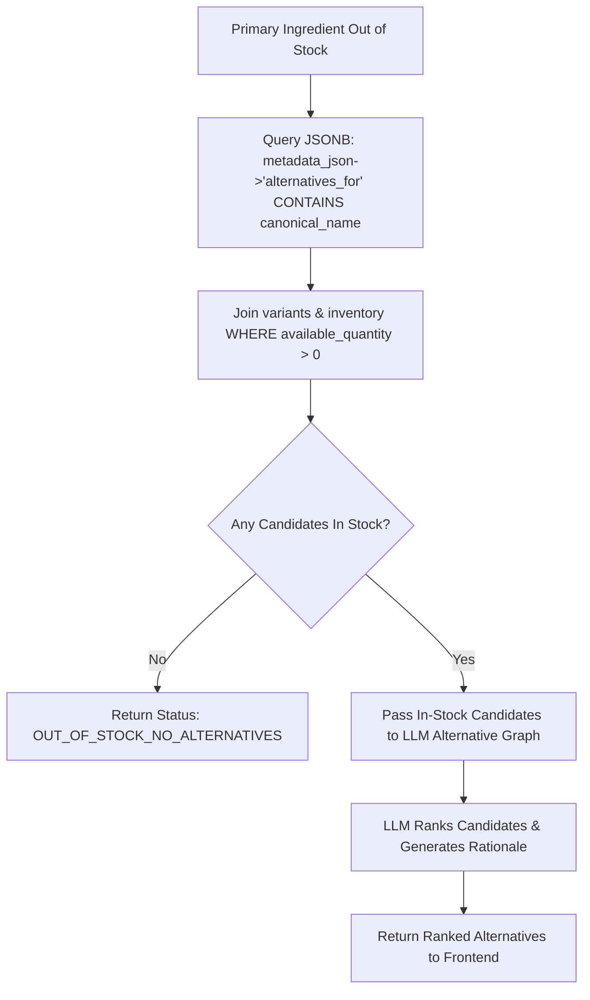

# Document 08: Product Matching & Alternative Discovery Engine

## 1. Product Matching Core Logic
The product matching engine bridges normalized recipe ingredients with actual purchasable SKUs in PostgreSQL.

### Core Business Rules
1. **Deterministic Execution**: Matching is executed via pure PostgreSQL queries (`SQLModel`). No SQL Agents or non-deterministic LLMs are permitted to query the database directly.
2. **Multi-Variant Surfacing**: For a confirmed canonical ingredient (e.g. `milk`), the system retrieves **ALL available active SKUs** across every brand (e.g., Amul, Nandini, Country Delight) and size (500ml, 1L, 2L).
3. **Quantity Independence**: The recipe quantity (e.g., 500ml) is purely informational. The system DOES NOT filter out non-matching package sizes (e.g., 1L milk is presented alongside 500ml milk).
4. **Out-of-Stock Gatekeeper**: The Alternative Product Flow executes **ONLY IF** zero variants of the requested primary ingredient/category are in stock across all relevant brands and sizes (`available_quantity > 0`).

---

## 2. Product Matching SQL Query Architecture

### Step 1: Query Primary Matching Products
```python
# app/services/product_service.py
from sqlmodel import select
from sqlalchemy.dialects.postgresql import JSONB
from app.models.product import Product
from app.models.product_variant import ProductVariant
from app.models.inventory import Inventory

async def get_matching_variants_for_ingredient(session: AsyncSession, canonical_name: str):
    statement = (
        select(Product, ProductVariant, Inventory)
        .join(ProductVariant, Product.id == ProductVariant.product_id)
        .join(Inventory, ProductVariant.id == Inventory.variant_id)
        .where(Product.is_active == True)
        .where(ProductVariant.is_active == True)
        .where(Inventory.available_quantity > 0)
        .where(Product.metadata_json["canonical_ingredients"].contains([canonical_name]))
    )
    results = await session.exec(statement)
    return results.all()
```

---

## 3. Alternative Discovery Flow (Out-of-Stock Fallback)

If `get_matching_variants_for_ingredient()` returns an empty list, the system executes the **Alternative Discovery Flow**:



### Metadata Query for Compatible Alternatives
```python
async def get_compatible_alternatives(session: AsyncSession, canonical_name: str):
    # Query products where metadata_json['alternatives_for'] contains canonical_name
    statement = (
        select(Product, ProductVariant, Inventory)
        .join(ProductVariant, Product.id == ProductVariant.product_id)
        .join(Inventory, ProductVariant.id == Inventory.variant_id)
        .where(Product.is_active == True)
        .where(ProductVariant.is_active == True)
        .where(Inventory.available_quantity > 0)
        .where(Product.metadata_json["alternatives_for"].contains([canonical_name]))
    )
    results = await session.exec(statement)
    return results.all()
```

---

## 4. Concrete Examples

### Example 1: Primary Product Available
- **Recipe Requirement**: `milk` — 500ml
- **Inventory State**:
  - Amul Taaza 500ml: Available (qty: 20)
  - Amul Taaza 1L: Available (qty: 10)
  - Nandini Toned 500ml: Available (qty: 5)
  - Almond Milk 1L (Alternative): Available (qty: 15)
- **Result**: Show Amul 500ml, Amul 1L, and Nandini 500ml. **DO NOT** show Almond Milk (Out-of-stock rule: primary products exist).

### Example 2: Primary Product Out of Stock
- **Recipe Requirement**: `milk` — 500ml
- **Inventory State**:
  - Amul Taaza 500ml: Out of Stock (qty: 0)
  - Amul Taaza 1L: Out of Stock (qty: 0)
  - Nandini Toned 500ml: Out of Stock (qty: 0)
  - Almond Milk 1L: Available (qty: 15)
  - Soy Milk 1L: Available (qty: 8)
- **Result**: Execute Alternative Flow. Present Almond Milk and Soy Milk with LLM suitability ranking and rationale.

### Example 3: User Custom Selection & Multiple Quantities
- **Recipe Requirement**: `milk` — 500ml
- **User Selection**: Amul Taaza 1L
- **User Quantity**: 2 units
- **Result**: Cart updated with `variant_id="sku_amul_1L"`, `quantity=2`. Total price computed server-side ($54 x 2 = $108). Recipe quantity (500ml) does not restrict user choice.
