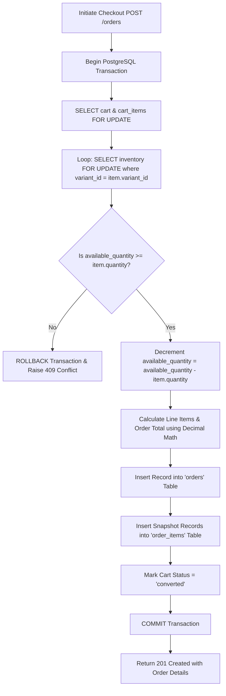

# Document 09: Inventory, Cart, & Order Transaction Architecture

## 1. Cart Management & Rules
The cart represents the transient state of products selected by a user prior to purchasing.

### Key Rules
- **SKU Binding**: Cart items are explicitly linked to a specific `ProductVariant.id` (SKU), never to an abstract product or canonical category name.
- **Quantity Independence**: Users may add any integer quantity (`quantity >= 1`) of a variant, subject to current inventory.
- **Cart Lifecycle**: Each user maintains one `active` cart. Upon successful checkout, the cart status is updated to `converted`, and a new `active` cart is initialized upon subsequent additions.

---

## 2. Checkout Pipeline & Transaction Safety

The checkout process converts an active cart into a confirmed order. It MUST handle concurrency and stock race conditions atomically within a **single PostgreSQL transaction** that acquires row locks (`FOR UPDATE`) on the active cart, cart items, and inventory rows.



### Atomic Checkout Implementation (Python / SQLModel)

> [!IMPORTANT]
> **Decimal Currency Standard**: Currency calculation relies strictly on `decimal.Decimal` from input through DB persistence and API serialization. Floating-point arithmetic (`float`) for currency is prohibited.

```python
# app/services/order_service.py
import uuid
from datetime import datetime
from decimal import Decimal
from fastapi import HTTPException, status
from sqlmodel.ext.asyncio.session import AsyncSession
from sqlmodel import select
from app.models.cart import Cart, CartStatus, CartItem
from app.models.inventory import Inventory
from app.models.order import Order, OrderItem, OrderStatus
from app.models.product_variant import ProductVariant
from app.models.product import Product

async def checkout_active_cart(session: AsyncSession, user_id: uuid.UUID) -> Order:
    async with session.begin():
        # 1. Fetch & lock active cart and items (FOR UPDATE)
        cart_statement = (
            select(Cart)
            .where(Cart.user_id == user_id, Cart.status == CartStatus.ACTIVE)
            .with_for_update()
        )
        cart_result = await session.exec(cart_statement)
        cart = cart_result.first()
        
        if not cart or not cart.items:
            raise HTTPException(
                status_code=status.HTTP_400_BAD_REQUEST, 
                detail={"code": "EMPTY_CART", "message": "Cart is empty or inactive"}
            )

        order_items_to_create = []
        total_order_amount = Decimal("0.00")

        # 2. Iterate and acquire ROW LOCKS (FOR UPDATE) on inventory for each cart item
        for item in cart.items:
            # Lock inventory row
            inv_statement = (
                select(Inventory)
                .where(Inventory.variant_id == item.variant_id)
                .with_for_update()
            )
            inv_result = await session.exec(inv_statement)
            inventory = inv_result.first()

            if not inventory or inventory.available_quantity < item.quantity:
                raise HTTPException(
                    status_code=status.HTTP_409_CONFLICT,
                    detail={
                        "code": "INSUFFICIENT_STOCK",
                        "variant_id": str(item.variant_id),
                        "requested": item.quantity,
                        "available": inventory.available_quantity if inventory else 0
                    }
                )

            # Lock variant and product rows to capture authoritative current Decimal price & snapshot details
            var_statement = (
                select(ProductVariant, Product)
                .join(Product, ProductVariant.product_id == Product.id)
                .where(ProductVariant.id == item.variant_id)
                .with_for_update()
            )
            var_result = await session.exec(var_statement)
            variant, product = var_result.first()

            # 3. Decrement Inventory
            inventory.available_quantity -= item.quantity
            session.add(inventory)

            # 4. Calculate line item totals using exact Decimal arithmetic
            line_total: Decimal = variant.price * Decimal(item.quantity)
            total_order_amount += line_total

            # 5. Build Historical OrderItem Snapshot (Decimal unit price and line total)
            order_item_snapshot = OrderItem(
                variant_id=variant.id,
                product_name_snapshot=product.name,
                brand_snapshot=product.brand,
                size_snapshot=variant.size,
                unit_snapshot=variant.size_unit,
                unit_price_snapshot=variant.price,
                quantity=item.quantity,
                line_total=line_total
            )
            order_items_to_create.append(order_item_snapshot)

        # 6. Create Order Entity
        order_number = f"ORD-{datetime.utcnow().strftime('%Y%m%d%H%M%S')}-{uuid.uuid4().hex[:4].upper()}"
        order = Order(
            user_id=user_id,
            order_number=order_number,
            total_amount=total_order_amount,
            status=OrderStatus.CONFIRMED,
            items=order_items_to_create
        )
        session.add(order)

        # 7. Convert Cart
        cart.status = CartStatus.CONVERTED
        session.add(cart)

    # Commit occurs automatically upon exiting 'async with session.begin()'
    await session.refresh(order)
    return order
```

---

## 3. Order Snapshot Integrity
Product details (prices, product names, size labels) change over time. To preserve historical financial integrity:
- `orders` stores the backend-calculated total amount (`total_amount` as `Decimal`).
- `order_items` stores copies of `product_name_snapshot`, `brand_snapshot`, `size_snapshot`, `unit_snapshot`, `unit_price_snapshot` (`Decimal`), and `line_total` (`Decimal`).
- Future updates to product catalog entries will **never corrupt or alter past order receipts**.
